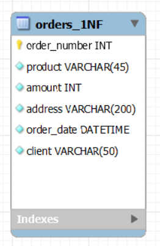
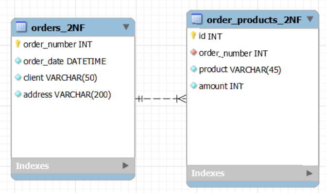
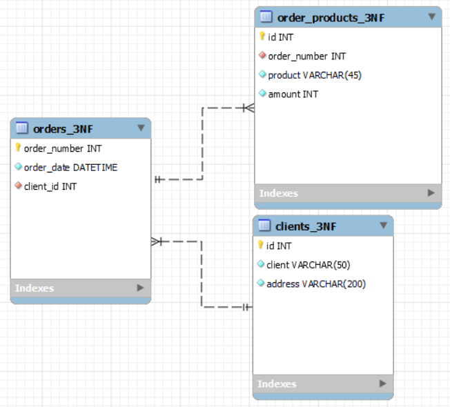
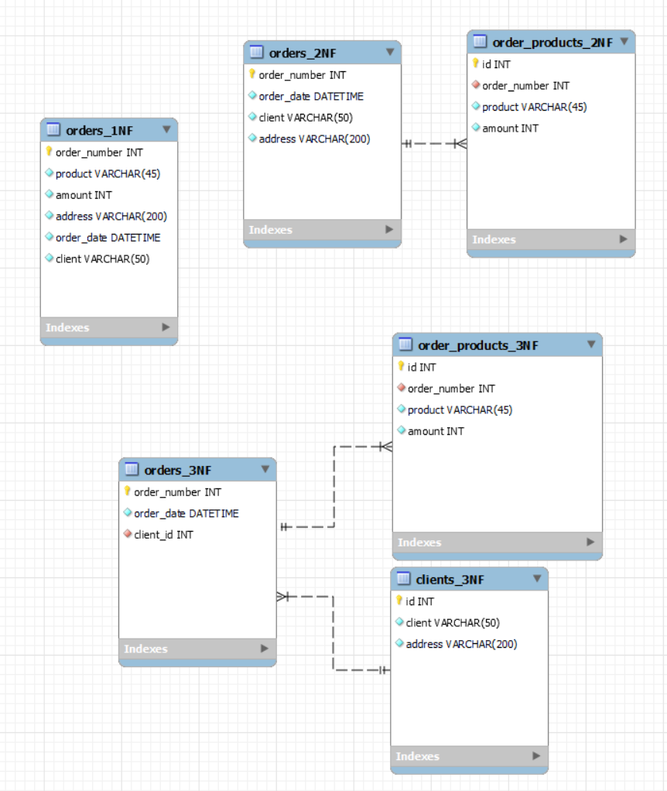
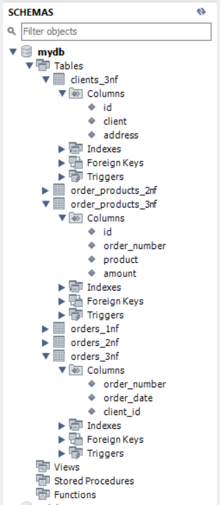

# goit-rdb-hw-02 — Нормалізація бази даних та ER-діаграма

Домашнє завдання з теми "Проектування баз даних з використанням семантичних моделей": переведення початкової таблиці до 1НФ, 2НФ, 3НФ, побудова ER-діаграми та створення таблиць у MySQL Workbench.

Обраний підхід: задовольнитися першою отриманою оцінкою.

## 1. Перша нормальна форма (1НФ)

Початкову таблицю розбито так, щоб кожна комірка містила одне атомарне значення (кожен товар у замовленні — окремий рядок).

## 2. Друга нормальна форма (2НФ)

Виділено окрему таблицю замовлень (`orders_2NF`) та окрему таблицю товарів у замовленні (`order_products_2NF`), щоб усунути часткову залежність атрибутів від складеного ключа.

## 3. Третя нормальна форма (3НФ)

Виділено окрему таблицю клієнтів (`clients_3NF`), щоб усунути транзитивну залежність адреси клієнта через клієнта, а не напряму від номера замовлення.

## 4. ER-діаграма

Діаграма відображає фінальні нормалізовані таблиці (`clients_3NF`, `orders_3NF`, `order_products_3NF`) та зв'язки між ними.

Файл діаграми: [`ER.mwb`](ER.mwb)

## 5. Розгорнута схема у Workbench

Створені таблиці зі стовпцями та зв'язками, розгорнуті у панелі Schemas.

